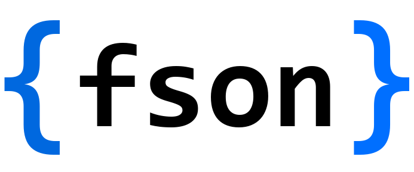

# Fson

[](http://godoc.org/github.com/kgwinnup/fson)
[](https://goreportcard.com/report/github.com/kgwinnup/fson)


Fson is a simple library for working with arbitrary JSON data of unknown
structure. One of the key reasons for creating this were to add two critical
features for my use cases. First was an Fmap function for easily applying a
function to the JSON data structure and secondly, provide a interface type for
dealing with Postgresql's JSON(b) types and that types encoding to JSON for our
REST api.

# Usage

Import package

```go
import (
	"github.com/kgwinnup/fson"
)
```

## Basic example of interacting with a JSON structure

```go
package main

import (
	"fmt"
	"github.com/kgwinnup/fson"
)

func main() {
	//receive some byte array and create an Fson object
	data := []byte(`{
        "foo": 1, 
        "foo2": { 
                    "bar": 1, 
                    "baz": [1,1,1]
                }
        }`)
	fsonobj := fson.New(data)

	// print the JSON string
	fmt.Println(fsonobj)

	// Get a value from the JSON
	if val, err := fsonobj.Get("foo2", "bar"); err != nil {
		fmt.Println(err)
	} else {

		//add 100 to our new value
		newVal := val.(float64) + 100

		//set the new value back in the JSON structure
		// the last bool parameter, if true, will turn the value in the key to an array
		fsonobj.Set(newVal, "foo2", "bar")
		fmt.Println(fsonobj)
	}

}
```

Output:

```
{"foo":1,"foo2":{"bar":1,"baz":[1,1,1]}}
{"foo":1,"foo2":{"bar":101,"baz":[1,1,1]}}
```

## Using generic "functional" functions

### Fmap

Fmap will apply a function to every value in the JSON while leaving the
underlying JSON structure unchanged. Only the values are mutated, mutation is
in place.

```go
import (
	"fmt"
	"github.com/kgwinnup/fson"
)

func main() {
    data := []byte(`{
		"foo": 1, 
		"foo2": {
			"bar": 1, 
			"baz": [1,1,1]
			}
		}`)
	out := New(data)

	out.Fmap(func(v interface{}) interface{} {
		switch v.(type) {
		case float64:
			return v.(float64) + 1
		default:
			return v.(int) + 1
		}
	})

	fmt.Println(out)
}
```

Output `{"foo":2,"foo2":{"bar":2,"baz":[2,2,2]}}`

### Filter

Filter will remove values that do not match the `FilterFn`. This function will
change the underlying JSON structure.

```go
import (
	"fmt"
	"github.com/kgwinnup/fson"
)

func main() {
    data := []byte(`{
		"foo": 2, 
		"foo2": {
			"bar": 1, 
			"baz": [2,1,1]
			}
		}`)
	out := New(data)

	out.Filter(func(v interface{}) bool {
		switch v.(type) {
		case float64:
			if v.(float64) > 1 {
				return false
			} else {
				return true
			}
		default:
			return true
		}
	})

	fmt.Println(out)
}
```

Output `{"foo2":{"bar":1,"baz":[1,1]}}`

## Usage with Postgresql's JSON types

For it to work with JSON types, the Scan interface is provided as well as a Bytes method. 

```go
import (
	"fmt"
	"github.com/kgwinnup/fson"
    "database/sql"
    _ "github.com/lib/pq"
)

type TableStruct struct {
    ItemId int64
    ItemDescription string
    ItemData *fson.Fson
}
```

To insert or update any JSON field, you must convert the value to a []byte array within the query.

```go
s := TableStruct{1, "description", fson.New([]byte{`{"foo": "bar"}`})}
_, err := db.Query(`insert into table(itemdescription, itemdata) values($1, $2)`, s.ItemDescription, s.ItemData.Bytes())
```

Getting serialized into your structure is just using the `row.Scan` method as you normally would.

```go
var tbl TableStruct
row := db.QueryRow(`select * from myTable where ItemId = 1;`)
err := row.Scan(&tbl.ItemId, &tbl.ItemDescription, &tbl.ItemData)
```
